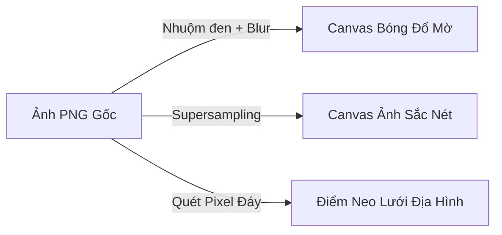

# Tinh Hoa Kỹ Thuật & Bài Học Lập Trình Sáng Tạo (Creative Coding)
*Đúc kết từ dự án nghệ thuật kiến trúc 2.5D: [boona13/mykonos-island-voxels](https://github.com/boona13/mykonos-island-voxels)*

Tài liệu này tổng hợp 5 bài học kỹ thuật cốt lõi và phương pháp tối ưu hóa hiệu năng đồ họa cực hạn từ dự án xây dựng đảo Mykonos. Đây là những "bí kíp" thực chiến giúp nâng tầm tư duy từ một lập trình viên Frontend thông thường lên cấp độ **Frontend Architect / Creative Coder** chuyên nghiệp.

---

## 1. Triết lý "Nướng Sẵn" Tài Nguyên (Load-Time Baking)

> **"Không bao giờ thực hiện các phép xử lý ảnh nặng nhọc trong vòng lặp render 60fps."**

### 🔍 Kỹ thuật thực tế trong dự án
Trong [assetLoader.js](file:///C:/Users/hieuh/modata.file.app/src/pages/FileComponent.vue), thay vì tính toán bóng đổ hoặc chỉnh sửa kích thước ảnh ở mỗi khung hình, tác giả thực hiện việc này **duy nhất một lần** tại màn hình tải trang (Loading Screen):
*   **Tạo bóng đổ tự động (`buildShadowCanvas`):** Hệ thống lấy ảnh gốc (PNG trong suốt), nhuộm đen toàn bộ (`globalCompositeOperation = 'source-in'`), áp bộ lọc mờ **`blur(6px)`** và lưu kết quả vào một Canvas đệm (`shadowCanvas`).
*   **Chống răng cưa (`buildDisplayCanvas`):** Ảnh gốc được vẽ lại (draw) lên một Canvas đệm khác với kích thước tương thích tối đa để trình duyệt không phải tự động co giãn (resample) ảnh lớn mỗi frame.
*   **Đo chân đứng (`buildContactPoints`):** Quét các pixel màu ở đáy của vật thể để tìm ra tọa độ tiếp đất chính xác (chân cột rào, móng nhà).



### 💡 Ứng dụng thực tiễn
*   **Cho FlexiForm:** Khi người dùng vẽ sơ đồ node logic, các hình vẽ phức tạp, các icon động và đường kết nối cong (Bezier Curves) sẽ được "nướng" sẵn vào bộ nhớ RAM. Khi người dùng cuộn/pan màn hình, hệ thống chỉ việc dán ảnh đệm này ra mà không cần tính toán lại tọa độ hình học.
*   **Lợi ích:** FPS giữ vững ở mức 60 cực mượt, CPU và GPU của thiết bị không bị quá tải.

---

## 2. Kiến Trúc Vẽ Đệm Phân Tầng (Layered Canvas Caching)

> **"Vẽ lại toàn bộ thế giới ở mỗi frame là một tội ác đối với thời lượng pin của thiết bị."**

### 🔍 Kỹ thuật thực tế trong dự án
File `Renderer.js` quản lý thế giới game bằng cách chia thành **4 Canvas bộ nhớ đệm (Cache Canvases) riêng biệt**:
1.  **Backdrop Cache:** Lớp nền trời và hiệu ứng ánh sáng (chỉ vẽ lại khi thay đổi kích thước trình duyệt).
2.  **Platform Cache:** Nền tảng hòn đảo trống (chỉ vẽ lại khi thay đổi kích thước lưới 14x14).
3.  **Terrain Cache:** Lớp đất và thảm cỏ (chỉ vẽ lại khi người dùng thay đổi địa hình đất/nước).
4.  **Static Objects Cache:** Lớp chứa toàn bộ nhà cửa, cây cối cố định (chỉ vẽ lại khi có hành động đặt mới hoặc xóa vật thể).

👉 **Cơ chế hoạt động:** Mỗi frame chạy, vòng lặp đồ họa chỉ làm duy nhất một việc là **chồng (composite) 4 tấm ảnh cache này lên nhau** bằng hàm `drawImage` siêu tốc của GPU. Chuyển động đàn hồi chỉ được vẽ riêng cho duy nhất khối block đang nảy lên tại vị trí đó.

```
┌──────────────────────────────────────────────┐
│  Layer 4: Animating Block (Vẽ động tại chỗ)  │
├──────────────────────────────────────────────┤
│  Layer 3: Static Objects (Canvas đệm tĩnh)    │
├──────────────────────────────────────────────┤
│  Layer 2: Terrain Grass/Water (Đệm tĩnh)     │
├──────────────────────────────────────────────┤
│  Layer 1: Backdrop & Light (Canvas đệm tĩnh) │
└──────────────────────────────────────────────┘
```

### 💡 Ứng dụng thực tiễn
*   **Cho FlexiForm:** Khi làm Canvas kéo thả Node, chúng ta sẽ chia làm 3 lớp đệm:
    *   *Lớp 1 (Tĩnh):* Lưới tọa độ hình nền (Background Grid).
    *   *Lớp 2 (Tĩnh):* Các đường kết nối dây không đổi.
    *   *Lớp 3 (Động):* Các Node đang được kéo chuột di chuyển.

---

## 3. Chống Vỡ Hình Trên Retina (High-DPI Supersampling)

> **"Canvas 2D sẽ bị mờ căm và vỡ nét trên màn hình độ phân giải cao nếu không được bù đắp mật độ điểm ảnh."**

### 🔍 Kỹ thuật thực tế trong dự án
Để đảm bảo trải nghiệm trực giác cực kỳ sắc nét trên màn hình máy tính Retina, màn hình điện thoại OLED thế hệ mới, tác giả áp dụng công thức Supersampling:
*   Các canvas đệm được nhân tỷ lệ kích thước theo công thức:
    $$\text{Width}_{\text{canvas}} = \text{Width}_{\text{display}} \times \text{devicePixelRatio} \times \text{MaxZoom}$$
*   Các ảnh assets được vẽ ở độ phân giải gấp **6 lần** kích thước CSS hiển thị thông thường trước khi lưu vào cache.
*   Khi người dùng Zoom sát camera vào một chiếc cối xay gió, các chi tiết nét vẽ vẫn sắc nét, mượt mà và không hề bị mờ hay vỡ hạt.

### 💡 Ứng dụng thực tiễn
*   Giúp giao diện các widget, sơ đồ vẽ logic, biểu đồ báo cáo của FlexiForm luôn sắc sảo tuyệt đối trên mọi màn hình cao cấp nhất (Retina Macbook, iPhone Pro Max, iPad Pro).

---

## 4. Tra Cứu Tọa Độ Không Gian Siêu Tốc $O(1)$ (Spatial Occupancy Index)

> **"Duyệt qua mảng bằng vòng lặp Array.find ở mỗi frame để kiểm tra va chạm là một thiết kế tồi."**

### 🔍 Kỹ thuật thực tế trong dự án
Trong file `TileMap.js`, thay vì quản lý các vật thể trên đảo dưới dạng một danh sách tuyến tính phẳng `[obj1, obj2, ...]` (khiến mỗi lần kiểm tra ô trống phải lặp qua toàn bộ mảng với độ phức tạp $O(n)$), tác giả sử dụng **Chỉ mục chiếm dụng không gian (Spatial Occupancy Grid)**:
*   Bản đồ được lưu dưới dạng một **Ma trận lưới 2 chiều** (hoặc Hash Map) khớp với tọa độ $(x, y)$ của hòn đảo.
*   Mỗi khi người dùng đặt một vật thể, game ghi đè thông tin ID vật thể vào đúng ô tọa độ trong ma trận.
*   Khi người dùng di chuột kiểm tra xem ô đất đó có trống hay không để đặt vật thể mới, game chỉ việc tra cứu trực tiếp:
    ```javascript
    const isOccupied = grid[x][y] !== null; // Độ phức tạp O(1) cực nhanh!
    ```

### 💡 Ứng dụng thực tiễn
*   **Cho FlexiForm:** Khi người dùng điền form hoặc kích hoạt logic ẩn hiện, chúng ta sẽ lưu sơ đồ phụ thuộc giữa các trường dữ liệu dưới dạng **Adjacency List (Danh sách kề)** bằng Hash Map. Khi trường A thay đổi -> tra cứu trực tiếp trong map các trường bị ảnh hưởng và cập nhật lập tức trong $O(1)$ giây, không gây trễ giao diện.

---

## 5. Triết lý "Zero-Dependency" & Module ES Thuần Khiết

> **"Không lạm dụng framework nặng nề khi sức mạnh của Vanilla JS và Web APIs là quá đủ."**

### 🔍 Kỹ thuật thực tế trong dự án
*   Dự án chứng minh rằng gu thẩm mỹ tinh tế (Aesthetics) và tư duy thuật toán thông minh có giá trị gấp trăm lần việc nhồi nhét hàng tá thư viện npm nặng nề.
*   Chỉ với HTML5 Canvas, Web Audio API, và các tệp Vanilla JS ES Modules cực kỳ gọn nhẹ, trò chơi vẫn tạo ra một thế giới trực quan, sống động và đầy cảm xúc lãng mạn.

### 💡 Ứng dụng thực tiễn
*   Luôn ưu tiên tối giản hóa các thư viện phụ thuộc trong dự án. Việc tự tay làm chủ cấu trúc lõi của phần mềm giúp bạn dễ dàng tùy biến, tối ưu hóa tốc độ tải trang cực hạn và bảo trì hệ thống lâu dài một cách dễ dàng.
