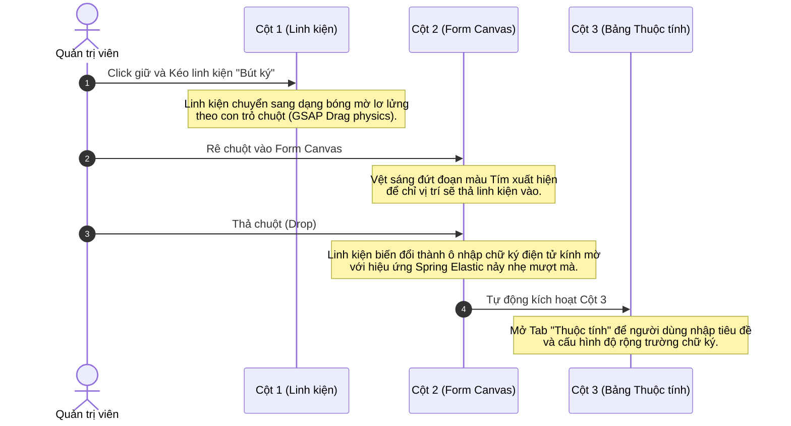

# ĐẶC TẢ THIẾT KẾ CHI TIẾT: TRÌNH DỰNG FORM KÉO THẢ (DRAG-AND-DROP FORM BUILDER)
*Dự án: FlexiForm - Động Cơ Biểu Mẫu | Phiên bản thiết kế: Premium Cosmic Obsidian 2.0 (Bản địa hóa)*

Tài liệu này đặc tả chi tiết từng khu vực giao diện, sơ đồ phân bổ màn hình (Layout), phông chữ, màu sắc và luồng tương tác kéo thả thời gian thực cho **Trang thứ tư (Drag-and-Drop Form Builder - Trình dựng Form kéo thả)** theo chuẩn thiết kế tối giản thượng lưu (Visual Density: 4).

---

## 🎨 1. CONCEPT & HỆ THỐNG MÀU SẮC (WYSIWYG Glassmorphic Canvas)
*   **Vibe chủ đạo:** Trực quan, mượt mà, chính xác đến từng điểm ảnh (What You See Is What You Get).
*   **Kiến trúc phân vùng (Pane Separation):** Đồng bộ hoàn toàn với Trang 3, không dùng các thẻ card đóng hộp lộn xộn. Toàn bộ màn hình được định hình phẳng lỳ bằng **các đường kẻ Zinc-900 mảnh 1px** trên nền tối Obsidian sâu thẳm (`#030303`).
*   **Điểm nhấn thị giác:** Khung xem thử biểu mẫu (Live Form Container) ở trung tâm sẽ được dựng dạng **Kính mờ Refraction cực độ** để nổi bật hẳn lên như một tấm kính trong suốt phát sáng giữa không gian tối.

---

## 🧭 2. BỐ CỤC CHIA 3 PHÂN VÙNG TUYỆT ĐỐI (3-PANE BUILDER LAYOUT)

```text
+------------------------------------------------------------------------------------+
|  [LOGO] Dự án v   |   Thanh công cụ Builder (Lưu cấu trúc, Chạy thử, Xuất Code)     |
+-------------------+-------------------------------------------------+--------------+
|                   |                                                 |              |
|  CỘT 1 (20%)      |   CỘT 2 (60%)                                   |  CỘT 3 (20%) |
|  Hộp linh kiện    |   Khung Xem Thử Thời Gian Thực                  |  Cấu hình    |
|  Form (Drag Box)  |   (Live Glassmorphic Preview Canvas)            |  Trường &    |
|                   |                                                 |  Giao diện   |
|                   |                                                 |              |
|                   |                                                 |              |
+-------------------+-------------------------------------------------+--------------+
```

---

### 📥 CỘT 1 (BÊN TRÁI - 20%): HỘP WIDGET LINH KIỆN (COMPONENT CABINET)
Danh sách các trường nhập liệu được phân loại rõ ràng dưới dạng các khối nhỏ tối giản để người dùng kéo thả sang Canvas trung tâm.
*   **Phân loại 1: TRƯỜNG CƠ BẢN (Basic Fields):**
    *   `Văn bản ngắn` (Text Input)
    *   `Văn bản dài` (Text Area)
    *   `Email liên hệ` (Email Input)
    *   `Lựa chọn duy nhất` (Radio)
    *   `Nhiều lựa chọn` (Checkbox)
*   **Phân loại 2: WIDGET NÂNG CAO (Advanced Plugins):**
    *   `Tải file kéo thả` (File Uploader)
    *   `Bút ký điện tử` (Signature Pad)
    *   `Bản đồ định vị` (Map Selector)
    *   `Đánh giá xếp hạng` (Rating Star)
*   *Visual:* Các khối linh kiện là các ô chữ nhật phẳng màu đen xám (`bg-zinc-950`), viền Zinc-900 mảnh, kèm một icon nét mảnh đại diện (không sử dụng emoji). Khi di chuột vào (Hover), viền ô chuyển sang Cyan phát sáng nhẹ.

---

### 🎨 CỘT 2 (TRUNG TÂM - 60%): KHUNG XEM THỬ KÍNH MỜ THỜI GIAN THỰC (LIVE PREVIEW CANVAS)
Trái tim của trình dựng biểu mẫu, mô phỏng chính xác giao diện hiển thị cuối cùng của người dùng.
*   **Nền Canvas:** Màu tối Obsidian sâu thẳm làm nổi bật tấm kính trung tâm.
*   **Tấm kính biểu mẫu (Live Form Container):**
    *   Đặt chính giữa màn hình, chiều rộng giới hạn `max-w-xl`.
    *   Chất liệu: Kính mờ siêu trong suốt (`rgba(255, 255, 255, 0.03)` kết hợp `backdrop-filter: blur(24px)`) với đường viền khúc xạ 1px sắc lẹm.
    *   Hiển thị tiêu đề biểu mẫu lớn ở trên cùng (Outfit).
*   **Các Trường đang dựng (Active Fields):**
    *   Hiển thị trực quan các ô nhập liệu thực tế (Họ và Tên, Email...).
    *   **Hiệu ứng chọn trường (Active/Hover Field):** Khi di chuột qua một ô nhập liệu trên Form xem thử, một đường viền mảnh màu Cyan sẽ bao quanh ô đó, đồng thời xuất hiện một **thanh công cụ nổi siêu nhỏ (Floating Tooltip)** màu kính mờ ở góc trên bên phải gồm 3 icon mảnh: `Di chuyển (Drag Handle)`, `Nhân đôi`, và `Xóa (Bin)`.
    *   **Đường kẻ chỉ vị trí thả (Drop Indicator):** Khi kéo một linh kiện từ Cột 1 sang và rê trên Form, một vệt sáng đứt đoạn màu Tím Neon sẽ xuất hiện chạy ngang để định vị chính xác vị trí sẽ thả linh kiện vào.

---

### ⚙️ CỘT 3 (BÊN PHẢI - 20%): THUỘC TÍNH CHI TIẾT & HIỆU CHỈNH GIAO DIỆN (INSPECTOR)
Cột điều khiển đa năng, chia làm 2 Tab chuyển đổi mượt mà bằng CSS transitions:

#### Tab 1: Thuộc tính trường (Field Properties)
*   **Cấu hình nhãn (Label):** Thay đổi nội dung hiển thị của nhãn nằm trên ô nhập.
*   **Gợi ý (Placeholder):** Nhập dòng chữ mờ mô tả bên trong ô nhập.
*   **Kiểm duyệt dữ liệu (Validation Rules):**
    *   Bật tắt công tắc: `Bắt buộc điền` (Required).
    *   Các giới hạn độ dài ký tự tối thiểu/tối đa.

#### Tab 2: Hiệu chỉnh Giao diện (Theme Customizer)
*   Bảng điều khiển các thông số mỹ thuật của Form:
    *   **Độ mờ kính (Glass Opacity):** Thanh trượt điều khiển opacity từ 1% đến 10%.
    *   **Độ nhòe kính (Backdrop Blur):** Thanh trượt điều khiển blur từ 0px đến 40px.
    *   **Bo góc (Border Radius):** Lựa chọn bo góc vuông vắn (6px), mềm mại (12px), hoặc bầu tròn (24px).
    *   **Tông màu thương hiệu:** Lựa chọn thay đổi màu Accent (mặc định Cyan `#00F0FF`).

---

## ⚡ 3. LUỒNG THAO TÁC KÉO THẢ VẬT LÝ (PHYSICS INTERACTION FLOW)


