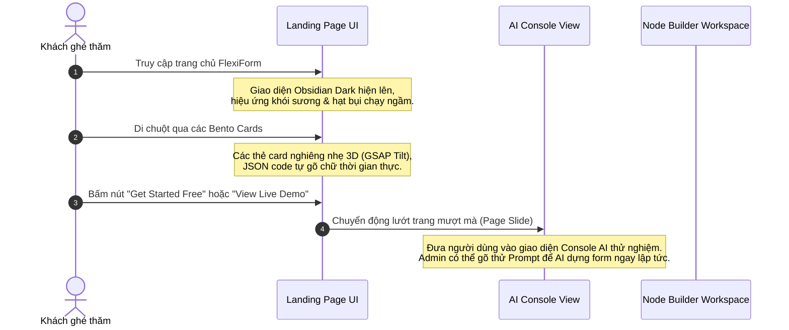

# ĐẶC TẢ THIẾT KẾ CHI TIẾT: LANDING PAGE (TRANG CHỦ)
*Dự án: FlexiForm - The Logic Engine | Phiên bản thiết kế: Premium Cosmic Obsidian 1.0*

Tài liệu này định hình chi tiết từng điểm ảnh (pixel-perfect), bảng màu, phông chữ, hình ảnh, hiệu ứng động và luồng thao tác người dùng (User Flow) cho **Trang đầu tiên (Landing Page)** của FlexiForm. Đây là sự kết hợp hoàn hảo giữa triết lý thiết kế cao cấp (Premium Aesthetics) và các bài học tối ưu hóa hiệu năng từ dự án Modata & Mykonos Island.

---

## 🎨 1. CONCEPT & HỆ THỐNG NHẬN DIỆN THƯƠNG HIỆU

### A. Concept Sáng Tạo: "Cosmic Obsidian & Neon Logic Catalyst"
*   **Vibe chủ đạo:** Sang trọng, huyền bí, mang tính tương lai nhưng vô cùng gọn gàng và đáng tin cậy (Enterprise-grade).
*   **Ý tưởng thị giác:** Một không gian tối đen tuyền sâu thẳm của đá Obsidian núi lửa, được thắp sáng bởi các luồng bụi vũ trụ (Nebula) màu Xanh ngọc (Cyan) và Tím neon (Violet), tượng trưng cho luồng dữ liệu (Data Flow) và tư duy logic chuyển động không ngừng.

### B. Bảng Màu Chi Tiết (Tailored Palette)
*   **Màu Nền (Backgrounds):**
    *   `#030303` (Obsidian Base) làm nền tối sâu thẳm.
    *   Gradient nền: `linear-gradient(180deg, #030303 0%, #0A0A0F 100%)`.
*   **Màu Điểm Nhấn (Accents & Highlights):**
    *   **Hyper Cyan:** `#00F0FF` (Tượng trưng cho sự thông minh, tốc độ và AI).
    *   **Neon Purple:** `#8B5CF6` (Tượng trưng cho cấu trúc logic và hệ thống).
    *   **Gold Ochre:** `#D4AF37` (Màu vàng kim sang trọng, dùng điểm xuyết cho các huy hiệu cao cấp).
*   **Bề Mặt Kính Mờ (Glassmorphism Surfaces):**
    *   Màu thẻ (Cards): `rgba(10, 10, 15, 0.65)` kết hợp với `backdrop-filter: blur(20px)`.
    *   Đường viền trong suốt (Inner Border): `1px solid rgba(255, 255, 255, 0.08)`.
    *   Bóng mờ viền (Box Glow): `0 8px 32px 0 rgba(0, 240, 255, 0.05)`.

### C. Phông Chữ (Typography Grid)
*   **Tiêu đề lớn (Headings):** Phông chữ **Outfit** (Google Fonts). Phông chữ hình học không chân hiện đại, khoảng cách chữ được co hẹp (`letter-spacing: -0.03em`), tạo cảm giác chắc chắn, chuyên nghiệp.
*   **Văn bản nội dung (Body):** Phông chữ **Inter** (Google Fonts). Tối ưu hóa cho trải nghiệm đọc văn bản, độ tương phản cao, cân bằng thị giác tuyệt vời.
*   **Mã code (Code/JSON):** Phông chữ **Fira Code** có tính năng nối chữ (ligatures), tạo cảm giác sành điệu cho lập trình viên.

---

## 🧭 2. BỐ CỤC CHI TIẾT & HIỆU ỨNG (PAGE SECTIONS SPEC)

### 📌 SECTION 1: THANH ĐIỀU HƯỚNG (HEADER NAV - FIXED GLASS)
*   **Bố cục:** Rộng 100%, cố định ở đỉnh màn hình, tự động làm mờ nền phía sau khi cuộn trang (`backdrop-filter: blur(12px)`).
*   **Logo FlexiForm:**
    *   *Visual:* Một chữ **"F"** cách điệu màu xanh Cyan, tạo thành từ 3 điểm tròn kết nối với nhau bằng các nét viền mảnh, mô phỏng sơ đồ Node logic.
    *   *Text:* Chữ **"FlexiForm"** màu trắng (`font-weight: 600`), bên dưới có dòng chữ phụ màu vàng Gold siêu nhỏ: *"The Logic Engine"*.
*   **Menu liên kết:** *Features, Pricing, Documentation, Resources* (có mũi tên chevron chỉ xuống nhỏ 8px).
    *   *Hiệu ứng Hover:* Chữ chuyển từ màu xám nhạt `rgba(255,255,255,0.6)` sang trắng tinh, một vệt sáng mỏng màu Cyan xuất hiện chạy từ trái sang phải dưới chân chữ (`transition: all 0.3s cubic-bezier(0.4, 0, 0.2, 1)`).
*   **Nút Hành Động (CTA Button):** *"Get Started"*
    *   *Visual:* Viền mảnh màu Cyan, nền trong suốt. Khi hover, nút tự động đổ đầy màu Cyan phát sáng, đẩy chữ màu đen lên và có bóng mờ lan tỏa ra xung quanh.

---

### 📌 SECTION 2: KHÔNG GIAN ANH HÙNG (HERO ZONE - THE SHOWCASE)

#### ◀️ Khối bên trái: Content & CTAs
*   **Huy hiệu (Pill Badge):** *"🚀 The Next Generation Form Platform"*
    *   *Visual:* Khung viền gradient cầu vồng tối giản, nền đen kính mờ, chữ màu vàng Gold nhạt.
*   **Tiêu đề chính (Main H1 Heading):** 
    *   *"FlexiForm: Build Forms at the Speed of Thought."*
    *   *Visual:* Chữ *"FlexiForm"* tô màu Gradient từ Cyan sang Violet. Từ khóa *"Speed of Thought"* có đổ bóng phát sáng nhẹ phía sau chữ.
*   **Mô tả phụ (Subtitle):** *"The world's most advanced metadata-driven engine for enterprise logic. No code, just flow."*
*   **Cặp nút hành động kép:**
    *   *Nút 1 (Primary):* **"Get Started Free →"** - Nền Cyan rực rỡ, chữ đen, bo góc mềm mại 8px. Hiệu ứng co giãn nhẹ (elastic bounce) khi di chuột vào.
    *   *Nút 2 (Secondary):* **"View Live Demo ▶"** - Viền kính mờ, icon Play đặt trong vòng tròn nhỏ.

#### ▶️ Khối bên phải: Glowing Tablet & Node Flow (Bản vẽ Độc quyền)
*   **Chiếc máy tính bảng 3D (Glowing Tablet):**
    *   Đặt nghiêng một góc 15 độ, hiển thị một form "Customer Onboarding" kính mờ. Các ô nhập liệu có viền neon xanh dịu.
*   **Sơ đồ Node nổi lơ lửng (Floating Nodes):**
    *   Nằm song song bên cạnh máy tính bảng là 3 tấm thẻ Node logic kính mờ, viền xanh tím phát sáng:
        1.  `Node 1: If (Department is Engineering)`
        2.  `Node 2: Show (Access Level Admin)`
        3.  `Node 3: Validate (ID Document Required)`
*   **Hiệu ứng dây nối (Pulse Paths):**
    *   Các đường cong kết nối từ form sang các Node được vẽ bằng thẻ `<svg>` dạng nét đứt màu xanh Cyan.
    *   **Hiệu ứng động:** Các chấm sáng nhỏ chạy liên tục dọc theo các dây nối (Marching Ants effect) để mô phỏng dữ liệu đang chảy trong thời gian thực.

---

### 📌 SECTION 3: KHUNG LƯỚI TÍNH NĂNG (BENTO GRID 2.0 FEATURES)
Gồm 5 thẻ Card kính mờ xếp thành lưới Bento bất đối xứng, mỗi thẻ minh họa một tính năng cốt lõi:

*   **Card 1: Visual Logic Builder (2 cột x 1 dòng)**
    *   *Visual:* Một sơ đồ Node nhỏ gồm: `Field A ──► If ──► Field B / Field C`.
    *   *Hiệu ứng:* Khi di chuột qua, các Node tự động nhấp nháy phát sáng theo thứ tự truyền dữ liệu.
*   **Card 2: AI-Powered Schema Generation (1 cột x 2 dòng)**
    *   *Visual:* Bên trên là ô nhập Prompt: *"Create a gym form..."*. Bên dưới là khung hiển thị mã JSON schema được tô màu cú pháp (Syntax Highlight).
    *   *Hiệu ứng:* Chữ tự động gõ (Typewriter) mã JSON liên tục khi người dùng cuộn đến vị trí Card này.
*   **Card 3: Metadata-Driven Engine (1 cột x 1 dòng)**
    *   *Visual:* 3 tấm thẻ kính 3D xếp chồng lên nhau lơ lửng, tượng trưng cho các tầng kiến trúc phân tách của hệ thống (giống Modata).
*   **Card 4: Runtime Plugin System (1 cột x 1 dòng)**
    *   *Visual:* Hiển thị các icon của các Widget nâng cao: Bút ký tên, Bản đồ định vị, Đánh giá sao.
*   **Card 5: Real-time Collaboration (1 cột x 1 dòng)**
    *   *Visual:* Các avatar của các thành viên đang thiết kế form chung kèm ký hiệu bong bóng chuột thời gian thực: *"Hieu is editing node..."*.

---

### 📌 SECTION 4: THƯƠNG HIỆU TIN CẬY (TRUSTED BY LOGOS)
*   **Bố cục:** Dòng chữ nhỏ *"TRUSTED BY INNOVATIVE TEAMS"*, bên dưới là logo của các thương hiệu lớn: *Acme Corp, Linear, Vercel, Lattice, Raycast, Framer*.
*   **Màu sắc:** Tất cả logo được lọc màu xám mờ đồng bộ (`filter: grayscale(1) opacity(0.4)`). Khi hover, logo tự động khôi phục màu gốc của thương hiệu và sáng lên nhẹ nhàng.

---

## 🔄 3. LUỒNG THAO TÁC CỦA NGƯỜI DÙNG (USER INTERACTIVE FLOW)

---

## ⚡ 4. HIỆU ỨNG VI MÔ (MICRO-INTERACTIONS) ĐỈNH CAO

### A. Hiệu ứng Khói Sương & Bụi Vũ Trụ nền (Cosmic Particle Background)
*   Tương tự như demo Huyền Mệnh của bạn, nền trang chủ sẽ có **3 lớp khói mờ ảo** trôi ngược hướng nhau cực chậm (`opacity: 0.1`) kết hợp với các hạt bụi phát sáng siêu nhỏ bay lơ lửng để tạo cảm giác không gian 3 chiều có chiều sâu tuyệt đối.

### B. Hiệu ứng Nghiêng 3D của Thẻ Card (3D Magnetic Tilt)
*   Sử dụng thư viện GSAP để bắt sự kiện chuột. Khi di chuột vào một thẻ Card bất kỳ, thẻ đó sẽ hơi nghiêng nhẹ (tilt) hướng về phía con trỏ chuột của người dùng, vệt sáng phản chiếu trên đường viền kính (glare border) sẽ chạy đuổi theo con trỏ, tạo cảm giác thẻ được làm bằng kính thật phản chiếu ánh sáng.

### C. Hiệu ứng Elastic Bounce cho các tương tác bấm nút
*   Tất cả nút bấm chuyển đổi trạng thái khi hover sẽ sử dụng hàm chuyển động đàn hồi vật lý:
    `transition: transform 0.6s cubic-bezier(0.34, 1.56, 0.64, 1)`. 
    Nút bấm sẽ co giãn nhẹ giống như chất liệu cao su, tạo cảm giác vô cùng sướng tay khi tương tác.
